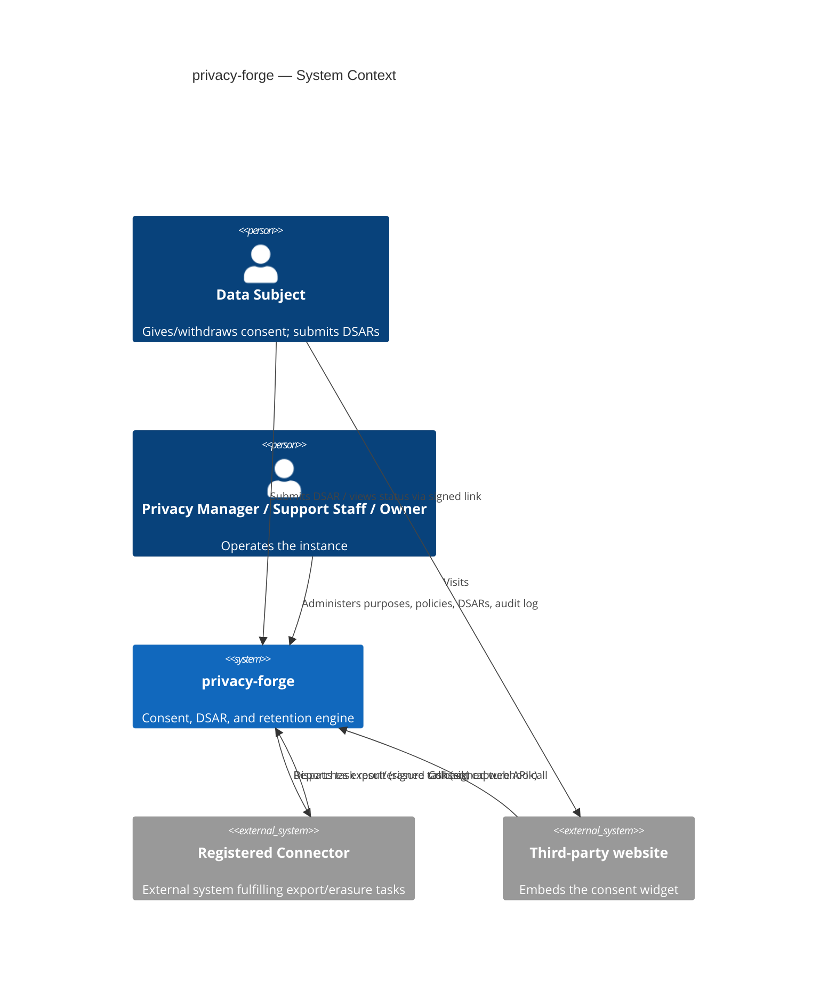
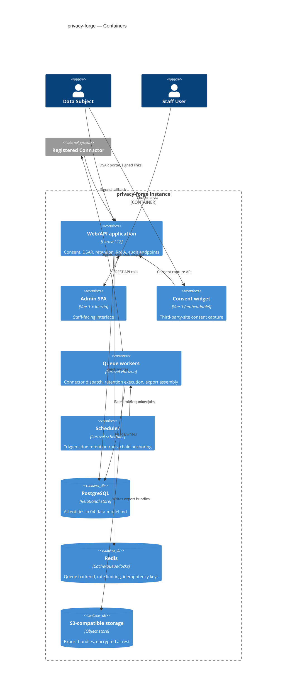
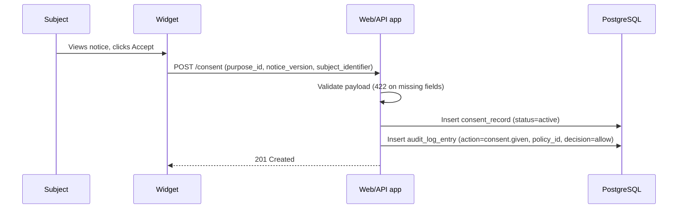
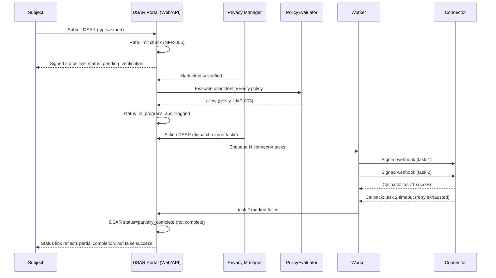

# Architecture
> Purpose: how the system is structured and why.
> Project: privacy-forge (public)
> Last updated: 2026-08-11

## System context diagram



## Container/component diagram



## Component responsibilities and boundaries

| Component | Responsibility | Explicitly not responsible for |
|---|---|---|
| Web/API application | Request handling, ABAC policy evaluation entry point, synchronous validation | Long-running work (export assembly, connector dispatch) — always handed to a worker |
| Admin SPA | Staff workflows: purposes, notices, retention, DSAR review, RoPA, audit log | Any authorisation logic — it calls the API and reflects the API's decisions, never decides locally |
| Consent widget | Rendering a notice and capturing a consent event on a third-party page | Storing anything client-side beyond what's needed to render; no local persistence of consent state |
| Queue workers | Connector task dispatch/callback handling, export bundle assembly, retention execution | Making authorisation decisions — a worker executes what has already been authorised, it does not re-decide |
| Scheduler | Triggering due retention runs and the chain-anchoring job on schedule | Any business logic itself — it only enqueues |
| PostgreSQL | System of record for every entity in the data model | Serving files directly — export bundles live in object storage, not the database |
| Redis | Queue backend, rate limiting (NFR-006), idempotency keys | Durable storage of anything that must survive a cache flush — nothing here is the only copy of anything |
| S3-compatible storage | Export bundle storage with short-lived signed URLs | Retaining bundles past their TTL — actively cleaned up, not just left to expire passively |

**The `PolicyEvaluator` (ADR-0001) sits inside the web/API application as a
service, invoked at the start of every sensitive-action controller method —
never inside a worker, and never bypassed by a worker acting on
already-authorised work handed to it.** This boundary matters: it means a
compromised or buggy worker cannot grant itself new permissions by skipping
a check a worker was never meant to perform in the first place.

## Key flows

### Consent capture



### DSAR lifecycle (export, showing partial-failure path)



### Retention: dry run then real execution (ADR-0002)

```mermaid
sequenceDiagram
    participant PM as Privacy Manager
    participant API as Web/API app
    participant Selector as RetentionSelector
    participant Executor as RetentionExecutor
    participant DB

    PM->>API: Request dry run for policy X
    API->>Selector: Select candidates(policy X)
    Selector->>DB: Query per policy criteria
    Selector-->>API: Candidate set C
    API->>Executor: Report(C), mode=dry_run
    Executor-->>PM: Preview report (no side effects)

    Note over PM,DB: Time passes; data unchanged

    API->>API: Scheduled run triggers (or PM confirms)
    API->>Selector: Select candidates(policy X)
    Selector->>DB: Same query, same criteria
    Selector-->>API: Candidate set C (identical, given unchanged data)
    API->>Executor: Act(C), mode=real
    Executor->>DB: Apply post_expiry_action to each record in C
    Executor->>DB: Insert deletion_certificate
    Executor-->>PM: Certificate issued
```

## Scalability approach

This is a single-organisation, self-hosted instance (ADR-0005) — the
realistic scale envelope is tens of thousands of consent records and a
modest, bursty volume of DSARs (not millions of records or high
concurrent write throughput). Architecture is deliberately **not**
over-engineered for a scale this product will never see:

- Web and worker containers are stateless and can be horizontally scaled
  behind a load balancer/reverse proxy if an operator genuinely needs it,
  but the reference deployment ships as a small number of containers
  (`docker-compose.prod.yml`, built at Deployment Session A — not
  Session 8, which this line previously and incorrectly claimed; see
  `09-decision-log.md`) — appropriate to the actual buyer (a 2–30 person
  company).
- Redis absorbs queue and rate-limiting load; no separate message broker is
  introduced (Kafka/RabbitMQ would be disproportionate here — that
  architectural pattern is deliberately demonstrated elsewhere in the
  portfolio, in R04 and R07, not duplicated in this repo).
- No read replica or database sharding is planned. A single PostgreSQL
  instance with routine backups is proportionate to the expected write
  volume and is explicitly stated as such, rather than silently assumed.

## Failure handling and degradation modes

| Failure | Handling |
|---|---|
| A connector is slow or unreachable | Task retried with exponential backoff up to a configured limit; on exhaustion, marked `failed`, DSAR reflects `partially_complete` — never silently `complete` (FR-009) |
| Queue worker crashes mid-task | Jobs are idempotent (keyed by task ID); a restarted worker re-processes safely without double-dispatching to a connector that already received the webhook |
| Chain-anchor destination is unreachable | Hash-chain verification still functions locally (entry-level tamper detection intact); an alert fires because anchor-strength tamper-evidence has degraded (ADR-0003) — this must not fail silently |
| Database briefly unavailable | Web/API returns 503 with `Retry-After`; queued jobs remain queued in Redis and are processed once the database recovers — no work is lost, only delayed |
| Signed export URL requested after expiry | Refused; the data subject must submit a new request rather than the link ever being extended (US-008) |

## Backup and recovery design

**RPO ≤ 24 hours, RTO ≤ 4 hours** — stated targets, to be verified by an
actual restore drill at Session 8 (not just asserted here).

- Nightly encrypted PostgreSQL backups, retained per a documented schedule
  (finalised at Session 8), stored separately from the primary instance.
- S3-compatible storage: export bundles are explicitly **excluded** from
  long-retention backup policies. This is a deliberate, non-obvious
  decision: if export bundles were backed up indefinitely, a data subject's
  72-hour-TTL export would effectively persist forever in a backup archive,
  quietly contradicting the very promise the TTL makes (NFR-007). Backups of
  the object storage bucket are therefore short-retention only (aligned to
  the 72-hour TTL window, not the general backup schedule), while
  `AUDIT_LOG_ENTRY` and `DELETION_CERTIFICATE` rows in PostgreSQL — the
  actual evidentiary record — follow the normal long-retention backup
  schedule, since retaining *evidence that an erasure happened* is the
  opposite problem from retaining *the erased data itself*.
- Restore drills are performed and their results recorded in
  `08-deployment-and-operations.md` (Session 8) — a backup that has never
  been restored is not a verified backup, only a hope.

## Technology choices summary

| Decision | ADR |
|---|---|
| Custom ABAC engine over framework gates or a third-party library | ADR-0001 |
| Shared selector service for retention dry-run/real-run parity | ADR-0002 |
| Hash-chained audit log with external anchoring, plus DB-level grants | ADR-0003 |
| Async, queue-based connector webhook contract | ADR-0004 |
| No tenant column anywhere in the schema | ADR-0005 |

All five ADRs are cross-referenced from `09-decision-log.md`; full reasoning
lives in `docs/adr/`.
