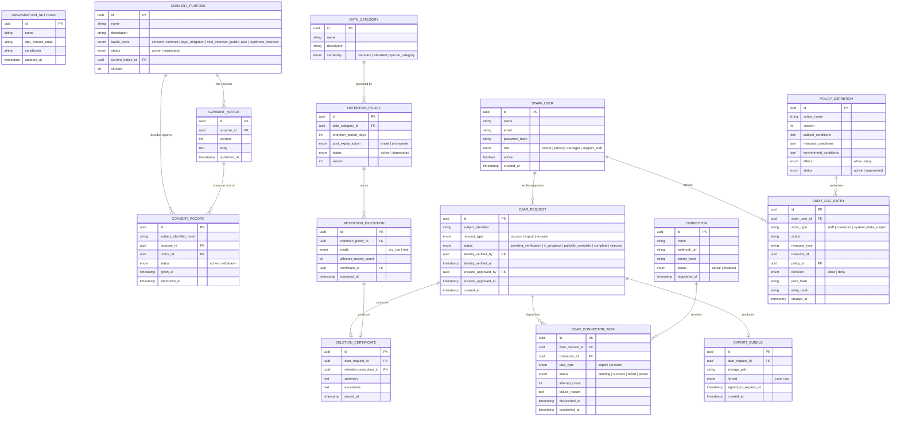

# Data Model
> Purpose: the authoritative description of stored data.
> Project: privacy-forge (public)
> Last updated: 2026-08-11

## ERD

## Entity descriptions

| Entity | Purpose | Key attributes | Classification |
|---|---|---|---|
| `ORGANISATION_SETTINGS` | The single-row settings record for this instance (per ADR-0005) | name, DPO contact, jurisdiction | Organisational metadata — not personal data |
| `STAFF_USER` | Internal operator accounts | role (owner/privacy_manager/support_staff) | Personal data (employee) |
| `DATA_CATEGORY` | Classifies what kind of data a retention policy governs | sensitivity level | Organisational metadata |
| `CONSENT_PURPOSE` | A named reason for processing, with its lawful basis | lawful_basis, version | Organisational metadata |
| `CONSENT_NOTICE` | Immutable, versioned wording shown to a data subject | version, body, published_at | Organisational metadata (the wording itself is not personal data; a specific consent record referencing it is) |
| `CONSENT_RECORD` | Evidence that a specific subject consented (or withdrew) to a specific notice version | subject_identifier_hash, status | Personal data |
| `CONNECTOR` | A registered external system that can fulfil export/erasure tasks | webhook_url, secret_hash | Organisational/infrastructure metadata |
| `DSAR_REQUEST` | A data-subject request and its lifecycle state | request_type, status, verification/approval actors | Personal data, elevated sensitivity |
| `DSAR_CONNECTOR_TASK` | One connector's independently tracked piece of a DSAR | status, attempt_count, failure_reason | Operational metadata (may reference personal data indirectly via the parent request) |
| `EXPORT_BUNDLE` | The assembled export artifact for a data subject | storage_path, format, signed_url_expires_at | Personal data, high sensitivity |
| `DELETION_CERTIFICATE` | Evidence of what was (or wasn't) erased | summary, exceptions | Evidentiary record |
| `RETENTION_POLICY` | Defines how long a data category is kept and what happens at expiry | retention_period_days, post_expiry_action | Organisational metadata |
| `RETENTION_EXECUTION` | A single dry-run or real run of a policy | mode, affected_record_count | Evidentiary record |
| `POLICY_DEFINITION` | An ABAC policy row (ADR-0001) | action_name, conditions (JSON), effect | Organisational/security metadata |
| `AUDIT_LOG_ENTRY` | Hash-chained, tamper-evident record of every sensitive action (ADR-0003) | policy_id, decision, prev_hash, entry_hash | Evidentiary record; may reference personal data indirectly. `actor_type: data_subject` added at Session 6a for unauthenticated public consent actions (capture/withdraw) — the original three values had no category for an actor who is neither staff, a connector, nor the system itself. |

**Demo seed data note:** every entity above, when populated in the public
demo instance, is generated synthetically (per FR-018/NFR-010). No table has
a code path that accepts real subject data on the demo instance —
enforced at the seeding/import layer, detailed in Session 8.

## Invariants and where they are enforced

| Invariant | Enforcement point |
|---|---|
| A `CONSENT_NOTICE` is never edited after publication; new wording is a new version | Application layer (no update endpoint exists) + DB grant restricting `UPDATE` on `consent_notices.body`/`published_at` |
| Withdrawing consent never deletes the `CONSENT_RECORD` row | Application layer: withdrawal is an `UPDATE` to `status`/`withdrawn_at` only, never a `DELETE`; DB grant revokes `DELETE` on this table entirely |
| `RETENTION_EXECUTION` dry-run and real-run share identical selection logic | `RetentionSelector` service, single code path (ADR-0002) — not a database constraint, but the parity test in Session 7 verifies it directly |
| A DSAR cannot reach `in_progress` without `identity_verified_by`/`identity_verified_at` set | DB check constraint + application-level guard (FR-007) |
| A DSAR's `erasure_approved_by` must differ from `identity_verified_by` | Enforced in the `dsar.erasure.approve` policy definition (ADR-0001), not a raw DB constraint — because it's a *policy*, changeable via policy versioning, not a schema migration |
| `AUDIT_LOG_ENTRY` rows are never updated or deleted | DB grants revoke `UPDATE`/`DELETE` for the application role entirely (ADR-0003); every entry additionally carries `prev_hash`/`entry_hash` |
| Exactly one `ORGANISATION_SETTINGS` row exists | DB-level unique constraint on a constant key column (ADR-0005) |
| `EXPORT_BUNDLE.signed_url_expires_at` is never more than 72 hours past `created_at` | Application-level guard at creation (NFR-007); enforced again at download-serving time regardless of what the row claims |

## Indexing strategy

- `consent_records(subject_identifier_hash, purpose_id, status)` — composite
  index; this is the hot lookup path for "is this subject currently
  consented to this purpose."
- `dsar_requests(status, created_at)` — supports the Privacy Manager's queue
  view and SLA-style triage.
- `dsar_connector_tasks(dsar_request_id, status)` — supports the
  partial-completion rollup query.
- `audit_log_entries(resource_type, resource_id, created_at)` — supports
  "show me the audit trail for this specific record" without needing to
  scan the full chain.
- `audit_log_entries(created_at)` alone, additionally, to support chain
  verification walking entries in insertion order efficiently.

No index is placed on `subject_identifier` in `dsar_requests` in plaintext;
it is treated the same as `consent_records.subject_identifier_hash` for
lookup purposes once hashing is finalised in implementation (Session 6) —
noted here so indexing and encryption decisions aren't made independently
of each other later.

## Migration approach and rollback

- Laravel migrations, one feature-slice per migration file (not one giant
  initial migration), so `08-deployment-and-operations.md` can document a
  real expand/contract pattern rather than an idealised one.
- Every migration that could run against non-empty data (i.e. anything after
  the initial schema) is written as expand-first: add new nullable
  columns/tables, backfill, only then add constraints — so a mid-deployment
  failure never leaves the schema in a state the previous application
  version can't read.
- Rollback: every migration implements a real `down()` method exercised in
  CI (Session 5) by migrating up, then down, then up again on a throwaway
  database — a migration whose rollback doesn't actually work is treated as
  a failing test, not a "we'll deal with it live" risk.

## Retention and deletion rules

- `CONSENT_RECORD`, `DSAR_REQUEST`, and their related rows are subject to
  the organisation's own configured retention policies (`RETENTION_POLICY`
  rows) — the tool applies its data-lifecycle discipline to its own data,
  not only to data it's asked to manage on the operator's behalf.
- `EXPORT_BUNDLE` storage objects are deleted from S3-compatible storage
  immediately upon signed-URL expiry (≤72h), regardless of whether the
  bundle was downloaded — enforced by a scheduled cleanup job, not left to
  bucket lifecycle rules alone, because bucket-level lifecycle policies
  typically operate on day-granularity, not hour-granularity.
- `AUDIT_LOG_ENTRY` and `DELETION_CERTIFICATE` rows are retained
  indefinitely by design — they are the evidentiary record, and deleting
  them would undermine the product's own purpose. Their *backup* handling
  (specifically: how this interacts with the 72-hour export-bundle deletion
  promise) is addressed explicitly in `03-architecture.md` under Backup and
  Recovery, because naive backups could otherwise quietly resurrect data
  that was supposed to be gone.
