# Data Model
> Purpose: the authoritative description of stored data.
> Project: privacy-forge (public)
> Last updated: 2026-08-11

## ERD

```mermaid
erDiagram
    ORGANISATION_SETTINGS {
        uuid id PK
        string name
        string dpo_contact_email
        string jurisdiction
        timestamp updated_at
    }

    STAFF_USER {
        uuid id PK
        string name
        string email
        string password_hash
        enum role "owner | privacy_manager | support_staff"
        boolean active
        timestamp created_at
    }

    DATA_CATEGORY {
        uuid id PK
        string name
        string description
        enum sensitivity "standard | elevated | special_category"
    }

    CONSENT_PURPOSE {
        uuid id PK
        string name
        string description
        enum lawful_basis "consent | contract | legal_obligation | vital_interests | public_task | legitimate_interests"
        enum status "active | deprecated"
        uuid current_notice_id FK
        int version
    }

    CONSENT_NOTICE {
        uuid id PK
        uuid purpose_id FK
        int version
        text body
        timestamp published_at
    }

    CONSENT_RECORD {
        uuid id PK
        string subject_identifier_hash
        uuid purpose_id FK
        uuid notice_id FK
        enum status "active | withdrawn"
        timestamp given_at
        timestamp withdrawn_at
    }

    CONNECTOR {
        uuid id PK
        string name
        string webhook_url
        string secret_hash
        enum status "active | disabled"
        timestamp registered_at
    }

    DSAR_REQUEST {
        uuid id PK
        string subject_identifier "encrypted at rest (reversible — see below)"
        string subject_identifier_hash "HMAC, rate-limit lookup only (NFR-006)"
        string status_token "opaque, unguessable; public status link key (T-05)"
        enum request_type "access | export | erasure"
        enum status "pending_verification | in_progress | partially_complete | complete | rejected"
        uuid identity_verified_by FK
        timestamp identity_verified_at
        uuid erasure_approved_by FK
        timestamp erasure_approved_at
        timestamp created_at
    }

    DSAR_CONNECTOR_TASK {
        uuid id PK
        uuid dsar_request_id FK
        uuid connector_id FK
        enum task_type "export | erasure"
        enum status "pending | success | failed | partial"
        int attempt_count
        text failure_reason
        timestamp dispatched_at
        timestamp completed_at
    }

    EXPORT_BUNDLE {
        uuid id PK
        uuid dsar_request_id FK
        string storage_path
        enum format "json | csv"
        timestamp signed_url_expires_at
        timestamp created_at
    }

    DELETION_CERTIFICATE {
        uuid id PK
        uuid dsar_request_id FK
        uuid retention_execution_id FK
        text summary
        text exceptions
        timestamp issued_at
    }

    RETENTION_POLICY {
        uuid id PK
        uuid data_category_id FK
        int retention_period_days
        enum post_expiry_action "erase | anonymise"
        enum status "active | deprecated"
        int version
    }

    RETENTION_EXECUTION {
        uuid id PK
        uuid retention_policy_id FK
        enum mode "dry_run | real"
        int affected_record_count
        uuid certificate_id FK
        timestamp executed_at
    }

    POLICY_DEFINITION {
        uuid id PK
        string action_name
        int version
        json subject_conditions
        json resource_conditions
        json environment_conditions
        enum effect "allow | deny"
        enum status "active | superseded"
    }

    AUDIT_LOG_ENTRY {
        uuid id PK
        uuid actor_user_id FK
        string actor_type "staff | connector | system | data_subject"
        string action
        string resource_type
        uuid resource_id
        uuid policy_id FK
        enum decision "allow | deny"
        string reason_code "nullable; set on denials (ADR-0006), added at Session 6b"
        string prev_hash
        string entry_hash
        timestamp created_at
    }

    CONSENT_PURPOSE ||--o{ CONSENT_NOTICE : "has versions"
    CONSENT_PURPOSE ||--o{ CONSENT_RECORD : "recorded against"
    CONSENT_NOTICE ||--o{ CONSENT_RECORD : "shown at time of"
    DSAR_REQUEST ||--o{ DSAR_CONNECTOR_TASK : "dispatches"
    CONNECTOR ||--o{ DSAR_CONNECTOR_TASK : "receives"
    DSAR_REQUEST ||--o| EXPORT_BUNDLE : "produces"
    DSAR_REQUEST ||--o| DELETION_CERTIFICATE : "produces"
    RETENTION_EXECUTION ||--o| DELETION_CERTIFICATE : "produces"
    DATA_CATEGORY ||--o{ RETENTION_POLICY : "governed by"
    RETENTION_POLICY ||--o{ RETENTION_EXECUTION : "run as"
    STAFF_USER ||--o{ DSAR_REQUEST : "verifies/approves"
    STAFF_USER ||--o{ AUDIT_LOG_ENTRY : "acts as"
    POLICY_DEFINITION ||--o{ AUDIT_LOG_ENTRY : "authorises"
```

## Entity descriptions

| Entity | Purpose | Key attributes | Classification |
|---|---|---|---|
| `ORGANISATION_SETTINGS` | The single-row settings record for this instance (per ADR-0005) | name, DPO contact, jurisdiction | Organisational metadata — not personal data |
| `STAFF_USER` | Internal operator accounts | role (owner/privacy_manager/support_staff) | Personal data (employee) |
| `DATA_CATEGORY` | Classifies what kind of data a retention policy governs | sensitivity level | Organisational metadata. Implemented at Session 11 (US-010) — the first implementation of an entity that had been ERD-only since Session 3. `subject_table` extends the ERD's listed columns: a closed enum (`consent_records`\|`dsar_requests`) naming which of this instance's own tables a governing `RetentionPolicy` actually queries — `App\Services\RetentionSelector` switches on it, and it is the only place that mapping is allowed to live. Deliberately excludes `audit_log_entries`/`deletion_certificates` by construction (the enum has no value for either), not by a runtime check — see the Retention and deletion rules section below. |
| `CONSENT_PURPOSE` | A named reason for processing, with its lawful basis | lawful_basis, version | Organisational metadata |
| `CONSENT_NOTICE` | Immutable, versioned wording shown to a data subject | version, body, published_at | Organisational metadata (the wording itself is not personal data; a specific consent record referencing it is) |
| `CONSENT_RECORD` | Evidence that a specific subject consented (or withdrew) to a specific notice version | subject_identifier_hash, status | Personal data |
| `CONNECTOR` | A registered external system that can fulfil export/erasure tasks | webhook_url, secret_hash | Organisational/infrastructure metadata. Implemented at Session 8 (ADR-0004). `secret_hash` — despite the ERD's name — is stored via Laravel's `encrypted` cast (reversible), not a one-way hash: the application must recompute the exact HMAC-SHA256 the connector computes, on both the outbound webhook and the inbound callback, which a true one-way hash would make impossible on either side. Only the reference/stub connector (FR-019) is registered in v1, via a `connectors:register-reference` artisan command — no registration admin UI exists yet. |
| `DSAR_REQUEST` | A data-subject request and its lifecycle state | request_type, status, verification/approval actors | Personal data, elevated sensitivity. `subject_identifier` implemented at Session 6b as an application-layer encrypted column (Laravel's `encrypted` cast, reversible — staff must be able to read the identity claim for the manual-verification stub, unlike `CONSENT_RECORD`'s one-way hash), with a separate `subject_identifier_hash` column used only for the NFR-006 rate-limit lookup. |
| `DSAR_CONNECTOR_TASK` | One connector's independently tracked piece of a DSAR | status, attempt_count, failure_reason | Operational metadata (may reference personal data indirectly via the parent request). Implemented at Session 8 (ADR-0004, `App\Services\DsarDispatcher`/`App\Jobs\DispatchConnectorTaskJob`/`App\Http\Controllers\ConnectorCallbackController`). `task_type` is `export`\|`erasure` only, per the ERD — a DSAR of `request_type: access` is dispatched as `task_type: export`, since an access request needs the same "collect from every connector" mechanism and the ERD has no third task_type value for it. Dispatch triggers: `verify-identity` for export/access (no separate approval gate exists for those types); `approve-erasure` for erasure. |
| `EXPORT_BUNDLE` | The assembled export artifact for a data subject | storage_path, format, signed_url_expires_at | Personal data, high sensitivity. Implemented at Session 8 (`App\Services\ExportBundleAssembler`). One row per (dsar_request, format) — a completed export produces two rows (json, csv) sharing one TTL window. `download_token` extends the ERD the same way `DSAR_REQUEST.status_token` did (T-05): an opaque, unguessable per-bundle key, wrapped in a Laravel URL signature wherever the download link is generated. The bundle's own bytes are served through this app's `dsar.export.raw` route (a second, short-lived signed link generated fresh per request) rather than an S3-native presigned URL, so local-disk and S3-backed deployments behave identically. Content is encrypted at the application layer (`Crypt::encryptString`, APP_KEY-derived) before it reaches object storage, satisfying FR-010's "encrypted at rest" independent of how a given deployment's bucket happens to be configured. Assembled content is drawn from what this instance itself holds (consent records by `subject_identifier_hash`) since no real connector ships in v1 (FR-019) — a real connector's data would be merged into the same bundle in a future session. |
| `DELETION_CERTIFICATE` | Evidence of what was (or wasn't) erased | summary, exceptions | Evidentiary record. Implemented at Session 8 (`App\Services\DeletionCertificateGenerator`); `retention_execution_id` populated for real starting Session 11 (`App\Services\RetentionExecutor::execute()`). **Shared table, two sources, by explicit Session 11 decision** (see `09-decision-log.md`): a certificate is produced by either a DSAR erasure (US-009, `dsar_request_id` set) or a retention execution (US-012, `retention_execution_id` set), never both and never neither — enforced by a DB CHECK constraint (`deletion_certificates_exactly_one_source`), not just application convention, so the two are structurally distinguishable without a separate "source" column that could drift out of sync with the FKs themselves. |
| `RETENTION_POLICY` | Defines how long a data category is kept and what happens at expiry | retention_period_days, post_expiry_action | Organisational metadata. Implemented at Session 11 (US-010/FR-012). Versioned exactly like `PolicyDefinition`/`ConsentNotice`: `data_category_id` is the grouping key across versions (mirroring `PolicyDefinition.action_name`) — an update supersedes the current active row for that category and creates version+1, never mutates in place. Staff-facing CRUD (`App\Http\Controllers\Admin\DataCategoryController`/`RetentionPolicyController`) is gated by a new sensitive action, `retention.policy.manage` (Owner or Privacy Manager), following ADR-0001's registry pattern the same way ADR-0006 added `policy.update`. |
| `RETENTION_EXECUTION` | A single dry-run or real run of a policy | mode, affected_record_count | Evidentiary record. Implemented at Session 11 (US-011/US-012, ADR-0002, `App\Services\RetentionExecutor`). A dry run is not "free" (per the ADR's own consequences): it produces this row too (`mode: dry_run`, `certificate_id` stays null), just as a real run produces both this row (`mode: real`) and a `DELETION_CERTIFICATE`. Scheduled real execution (`App\Console\Commands\ExecuteRetentionPoliciesCommand`, registered daily in `routes/console.php`) processes every currently-`active` `RetentionPolicy` each run — deliberately not gated by `PolicyEvaluator` itself; see the Retention and deletion rules section below for why that is a documented decision, not a gap. |
| `POLICY_DEFINITION` | An ABAC policy row (ADR-0001) | action_name, conditions (JSON), effect | Organisational/security metadata. Implemented at Session 6b, evaluated by `App\Services\PolicyEvaluator`. `dsar.identity.verify` (Session 6b) and `dsar.erasure.approve` (Session 7/6c) are registered; the remaining sensitive actions ADR-0001 names (retention execution, audit log access) are not yet registered since their endpoints don't exist yet. `dsar.erasure.approve`'s conditions use a new `not_equals_attribute` operator (ADR-0007) to compare the approving actor's id against the DSAR's `identity_verified_by`, and an `in` resource condition on `status`/`request_type` to enforce verified-before-approved. No seeding/bootstrap mechanism exists yet for either row — see `12-session-handoff.md` (`R-02`). |
| `AUDIT_LOG_ENTRY` | Hash-chained, tamper-evident record of every sensitive action (ADR-0003) | policy_id, decision, prev_hash, entry_hash | Evidentiary record; may reference personal data indirectly. `actor_type: data_subject` added at Session 6a for unauthenticated public consent actions (capture/withdraw) — the original three values had no category for an actor who is neither staff, a connector, nor the system itself. |

**Demo seed data note:** every entity above, when populated in the public
demo instance, is generated synthetically (per FR-018/NFR-010). No table has
a code path that accepts real subject data on the demo instance —
enforced at the seeding/import layer, detailed in Session 8.

## Invariants and where they are enforced

| Invariant | Enforcement point |
|---|---|
| A `CONSENT_NOTICE` is never edited after publication; new wording is a new version | Application layer (no update endpoint exists) + DB grant restricting `UPDATE` on `consent_notices.body`/`published_at` |
| Withdrawing consent never deletes the `CONSENT_RECORD` row | Application layer: withdrawal is an `UPDATE` to `status`/`withdrawn_at` only, never a `DELETE`; DB grant revokes `DELETE` on this table entirely |
| `RETENTION_EXECUTION` dry-run and real-run share identical selection logic | `RetentionSelector` service, single code path (ADR-0002) — not a database constraint; `tests/Feature/RetentionDryRunParityTest.php` (Session 11) verifies it directly, asserting dry-run candidate IDs and a subsequent real run's affected IDs are identical given unchanged data |
| `DELETION_CERTIFICATE` is produced by exactly one source — a DSAR erasure or a retention execution, never both, never neither | DB CHECK constraint (`deletion_certificates_exactly_one_source`, Session 11) on `dsar_request_id`/`retention_execution_id` |
| A DSAR cannot reach `in_progress` without `identity_verified_by`/`identity_verified_at` set | DB check constraint (`dsar_requests_verified_before_in_progress`, implemented Session 6b, confirmed via a direct-DB-write test that it rejects the update independent of the application layer) + application-level guard (`Admin\DsarController::verifyIdentity`) (FR-007) |
| A DSAR's `erasure_approved_by` must differ from `identity_verified_by` | Enforced in the `dsar.erasure.approve` policy definition (ADR-0001/ADR-0007, implemented Session 7/6c, confirmed via a real two-endpoint separation-of-duties test), not a raw DB constraint — because it's a *policy*, changeable via policy versioning, not a schema migration |
| `AUDIT_LOG_ENTRY` rows are never updated or deleted | DB grants revoke `UPDATE`/`DELETE` for the application role entirely (ADR-0003); every entry additionally carries `prev_hash`/`entry_hash` |
| Exactly one `ORGANISATION_SETTINGS` row exists | DB-level unique constraint on a constant key column (ADR-0005) |
| `EXPORT_BUNDLE.signed_url_expires_at` is never more than 72 hours past `created_at` | Application-level guard at creation (NFR-007, `ExportBundleAssembler`, clamped via `config('connectors.export_bundle_ttl_hours')`) + a DB check constraint (`export_bundles_ttl_max_72h`) as defence-in-depth; enforced again at download-serving time (`ExportBundleController::download`) against the row's own `signed_url_expires_at`, independent of what the outer URL's own signature would otherwise still allow |
| A `DSAR_CONNECTOR_TASK` in a terminal state (`success`\|`failed`\|`partial`) never has its status silently overwritten by a later callback | `ConnectorCallbackController` (T-08/T-09): the same status repeated is a no-op; a *conflicting* terminal status is logged as a security anomaly and auto-disables the connector, but never changes the task's own recorded status |
| A `DSAR_REQUEST` becomes `complete` only when every dispatched `DSAR_CONNECTOR_TASK` succeeded; any other terminal mix is `partially_complete`, never a false `complete` | `App\Services\DsarCompletionEvaluator` (FR-009), evaluated after every task state change (job-exhaustion failure or a connector callback) |

## Indexing strategy

- `consent_records(subject_identifier_hash, purpose_id, status)` — composite
  index; this is the hot lookup path for "is this subject currently
  consented to this purpose."
- `dsar_requests(status, created_at)` — supports the Privacy Manager's queue
  view and SLA-style triage.
- `dsar_connector_tasks(dsar_request_id, status)` — supports the
  partial-completion rollup query.
- `audit_log_entries(resource_type, resource_id, created_at)` — supports
  "show me the audit trail for this specific record" without needing to
  scan the full chain.
- `audit_log_entries(created_at)` alone, additionally, to support chain
  verification walking entries in insertion order efficiently.

No index is placed on `subject_identifier` in `dsar_requests` in plaintext —
implemented at Session 6b as planned: a dedicated `subject_identifier_hash`
column (indexed, `DsarRequest::hashIdentifier()`) is used for the NFR-006
rate-limit lookup, exactly mirroring `consent_records.subject_identifier_hash`.
The plaintext `subject_identifier` column itself is encrypted at the
application layer and is never indexed or queried directly — noted here so
indexing and encryption decisions aren't made independently
of each other later.

## Migration approach and rollback

- Laravel migrations, one feature-slice per migration file (not one giant
  initial migration), so `08-deployment-and-operations.md` can document a
  real expand/contract pattern rather than an idealised one.
- Every migration that could run against non-empty data (i.e. anything after
  the initial schema) is written as expand-first: add new nullable
  columns/tables, backfill, only then add constraints — so a mid-deployment
  failure never leaves the schema in a state the previous application
  version can't read.
- Rollback: every migration implements a real `down()` method exercised in
  CI (Session 5) by migrating up, then down, then up again on a throwaway
  database — a migration whose rollback doesn't actually work is treated as
  a failing test, not a "we'll deal with it live" risk.

## Retention and deletion rules

- `CONSENT_RECORD`, `DSAR_REQUEST`, and their related rows are subject to
  the organisation's own configured retention policies (`RETENTION_POLICY`
  rows) — the tool applies its data-lifecycle discipline to its own data,
  not only to data it's asked to manage on the operator's behalf.
  Implemented at Session 11: `App\Services\RetentionSelector` selects
  withdrawn `CONSENT_RECORD` rows past their retention window (active
  consent is never touched, regardless of age — this is the "never
  auto-deleted while a related lawful-basis question is open" rule from
  the data classification table above) and terminal-status `DSAR_REQUEST`
  rows (`complete`\|`partially_complete`\|`rejected`) past theirs.
  `AUDIT_LOG_ENTRY` and `DELETION_CERTIFICATE` are structurally excluded
  from ever being a retention-policy target — `DATA_CATEGORY.subject_table`
  simply has no enum value for either table — consistent with both being
  retained indefinitely by design (below) and with the Backup and
  Recovery distinction in `03-architecture.md` that this session's work
  was instructed not to touch.
- Scheduled real execution (`App\Console\Commands\ExecuteRetentionPoliciesCommand`,
  US-012) is deliberately **not** gated by `PolicyEvaluator`, unlike every
  `retention.policy.manage`-gated HTTP endpoint (data-category/retention-
  policy CRUD and the dry-run preview). `03-architecture.md`'s component
  table is explicit that a worker/scheduler "executes what has already
  been authorised, it does not re-decide" — the authorisation event for a
  retention policy is `retention.policy.manage`, at definition/update
  time; the scheduled run is that decision's scheduled consequence, not a
  new decision of its own. It still writes its own `AUDIT_LOG_ENTRY`
  (`actor_type: system`, `policy_id: null` — no ABAC policy backs a
  system-triggered action, which is the correct null, not a gap), since
  US-014 requires every retention action logged regardless.
- `EXPORT_BUNDLE` storage objects are deleted from S3-compatible storage
  immediately upon signed-URL expiry (≤72h), regardless of whether the
  bundle was downloaded — enforced by a scheduled cleanup job, not left to
  bucket lifecycle rules alone, because bucket-level lifecycle policies
  typically operate on day-granularity, not hour-granularity.
- `AUDIT_LOG_ENTRY` and `DELETION_CERTIFICATE` rows are retained
  indefinitely by design — they are the evidentiary record, and deleting
  them would undermine the product's own purpose. Their *backup* handling
  (specifically: how this interacts with the 72-hour export-bundle deletion
  promise) is addressed explicitly in `03-architecture.md` under Backup and
  Recovery, because naive backups could otherwise quietly resurrect data
  that was supposed to be gone.
