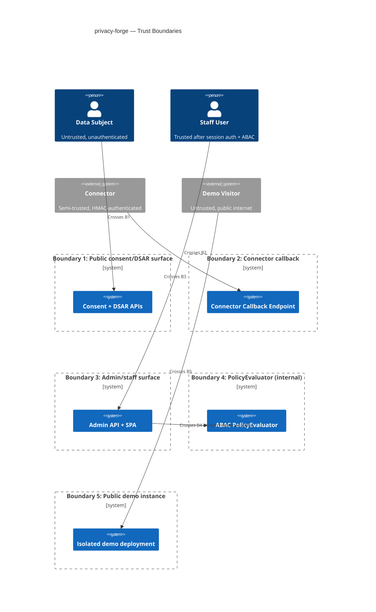

# Security and Threat Model
> Purpose: what can go wrong, and what stops it.
> Project: privacy-forge (public)
> Last updated: 2026-08-18

## Assets and data classification

See `docs/project-memory/02-requirements.md` (Data classification) and
`04-data-model.md` (Entity descriptions) for the full table. The two assets
that matter most for this threat model specifically:

1. **The audit log and its hash chain** — if this can be silently altered,
   every other guarantee this product makes (DSAR fulfilment, deletion
   certificates, RoPA accuracy) becomes unverifiable.
2. **The ABAC policy definitions and the evaluator that reads them** — if
   this can be bypassed or silently misconfigured, every access-control
   guarantee in the system collapses to whatever the underlying framework
   would have done anyway, which is exactly what ADR-0001 exists to avoid.

## Trust boundaries

Five boundaries are in scope for this model. Each is addressed below with
STRIDE threats, then abuse cases that cut across boundaries.

## Threats (STRIDE)

| ID | Boundary | Threat | Category | L/I | Mitigation | Verified by |
|---|---|---|---|---|---|---|
| T-01 | B1 Public consent API | Attacker submits a consent or withdrawal event for a `subject_identifier` they don't control, forging someone else's consent state | Spoofing | Med/High | Document that `subject_identifier` should be assigned server-side by the integrating site's backend, not taken from client-controlled input where avoidable; the widget's reference integration proxies capture through the integrator's own server | `tests/Feature/ConsentSpoofingTest.php` (Session 7) |
| T-02 | B1 Public consent API | Integrator falsely claims a notice version was shown that wasn't (weakening the evidentiary value of a consent record) | Tampering | Low/Med | Accepted risk — the system can only record what it's told; cannot verify third-party page rendering. See Accepted Risks below | N/A — documented limitation, not a control |
| T-03 | B1 Public consent API | Volumetric abuse of the capture endpoint | Denial of Service | Med/Low | IP-level rate limiting (distinct from the per-subject DSAR limit in NFR-006) | Load test, Session 7 |
| T-04 | B1 Public DSAR portal | Attacker submits a DSAR impersonating a real data subject to gain unauthorised access to, or erase, that subject's data | Spoofing | High/**Critical** | Manual identity-verification gate (FR-007) is mandatory before any export/erasure task executes — deliberately conservative (a human check) precisely because this is the highest-impact spoofing surface in the system | `tests/Feature/DsarIdentityGateTest.php` (Session 7) |
| T-05 | B1 Public DSAR portal | DSAR/status identifiers are enumerable, leaking the existence or status of other subjects' requests | Information Disclosure | Med/Med | Status and export access are keyed only by unguessable signed tokens (not sequential/plain DSAR IDs); no endpoint accepts a bare DSAR ID from an unauthenticated caller | `tests/Feature/DsarTokenOnlyAccessTest.php` (Session 7) |
| T-06 | B1 Public DSAR portal | Mass submission of bogus DSARs to consume Privacy Manager triage time (a social/operational DoS, not purely volumetric) | Denial of Service | Med/Med | Rate limiting (NFR-006) plus a Support Staff triage step before any DSAR reaches a Privacy Manager's queue | Manual process check, Session 9 |
| T-07 | B2 Connector callback | Forged callback without valid connector credentials | Spoofing | Med/High | HMAC-SHA256 signature required (ADR-0004); request rejected before touching business logic if signature invalid | `tests/Feature/ConnectorCallbackAuthTest.php` (implemented Session 8) |
| T-08 | B2 Connector callback | Replay of a previously valid, correctly-signed callback | Tampering (replay) | Low/Med | Signature includes a timestamp; callbacks outside a tolerance window (e.g. ±5 minutes) are rejected regardless of signature validity | `tests/Feature/ConnectorCallbackAuthTest.php` (implemented Session 8 — replay/idempotency cases live alongside the rest of the auth suite rather than a separate file) |
| T-09 | B2 Connector callback | **A connector reports a different terminal status for a task that already reached a terminal state** (the anomaly flagged in Session 3) | Tampering / potential Elevation of Privilege | Med/**High** | **Decision made in Session 4, implemented Session 8:** treated as a security anomaly, not a benign retry. The task is left in its original terminal state, the conflicting callback is logged as an anomaly, and **the connector is automatically disabled pending manual review** — a legitimate connector re-sending an identical status is a no-op (T-08's idempotency handling), so only a genuinely conflicting status trips this path | `tests/Feature/ConnectorCallbackAuthTest.php` (implemented Session 8 — same file as T-07/T-08, not the originally-anticipated `ConnectorAnomalyAutoDisableTest.php`) |
| T-10 | B2 Connector callback | A compromised or dishonest connector reports false `success` on an erasure task that didn't actually happen | Tampering / Repudiation | Low/**Critical** | Partially mitigated by manual connector registration (only trusted, internally-approved systems are registered) and by making the deletion certificate explicitly reference which connectors confirmed what (FR-011, implemented Session 8 — `App\Services\DeletionCertificateGenerator`). **The remaining risk is accepted and stated explicitly** — see Accepted Risks | Not fully testable — this is a trust-boundary limit, not a bug |
| T-11 | B3 Admin/staff surface | Session hijacking via stolen cookie | Spoofing | Low/High | `HttpOnly`, `Secure`, `SameSite=Strict` cookies; session regenerated on login; full session invalidation + token rotation on logout | `tests/Feature/LoginRateLimitTest.php` (Session 14 — R-05: session id changes on login, guard cleared and session invalidated on logout, against a real HTTP session, not just config review) |
| T-12 | B3 Admin/staff surface | CSRF on state-changing admin actions (e.g. approving erasure) | Tampering | Low/High | Laravel CSRF token middleware on all state-changing routes | `tests/Feature/CsrfProtectionTest.php` (Session 7) |
| T-13 | B3 Admin/staff surface | Credential stuffing / brute force against staff login | Spoofing | Med/High | Rate-limited login attempts with exponential backoff; generic error messages (no "email not found" vs "wrong password" distinction) | `tests/Feature/LoginRateLimitTest.php` (Session 7) |
| T-14 | B3 Admin/staff surface | Support Staff attempts an action reserved for Privacy Manager/Owner (e.g. approving erasure) | Elevation of Privilege | Med/High | Caught by the ABAC evaluator (ADR-0001) — this is precisely what the exhaustive (role × action) test suite (NFR-005) exists to prove has zero gaps | Authorisation test suite, Session 7 |
| T-15 | B4 PolicyEvaluator (internal) | A missing policy, malformed condition, or evaluator exception is misread as "no rule applies, so allow" | Elevation of Privilege | Low/**Critical** | **Fail-closed by design (ADR-0006, decided this session)** — any evaluator error defaults to deny, logged with a distinguishing reason code | Fault-injection tests in the authorisation test suite, Session 7 |
| T-16 | B4 PolicyEvaluator (internal) | Policy definitions edited directly at the database level, bypassing the application (e.g. a compromised DB credential) | Tampering | Low/**Critical** | DB-level `UPDATE` grant on `policy_definitions` restricted to the migration/seeding process, not the application's runtime role; all legitimate policy changes go through the `policy.update` sensitive action (added to the registry this session — Owner-only, audit-logged, itself gated by the same fail-closed evaluator) | `tests/Feature/PolicyDefinitionGrantTest.php` (Session 7, DB-grant assertion) |
| T-17 | B5 Public demo instance | Real personal data is accidentally entered into the public demo by a visitor or a demo operator | Information Disclosure | Med/**Critical** | See dedicated "Demo Instance Data Safety" section below | Manual pre-launch checklist (NFR-010), every deploy |
| T-18 | B5 Public demo instance | Demo instance is mistaken for, or connected to, a real production deployment (e.g. a real connector is registered against it) | Tampering | Low/Critical | Demo deployment ships with connector registration disabled entirely; only the reference stub connector is pre-seeded | Deployment config review, Session 8 |
| T-19 | B5 Public demo instance | A single shared "demo admin" credential is discovered and abused (spam, defacement, cost abuse) | Spoofing | Med/Med | No persistent shared admin credential is exposed publicly — see "Demo Instance Data Safety" | Session 8 deployment review |
| T-20 | B5 Public demo instance | Cost/resource abuse (e.g. scripted DSAR flood) driving the demo past its spend cap | Denial of Service | Med/Med | Aggressive rate limiting specific to the demo environment, hard infrastructure spend cap, alerting on approach to cap | Session 8 deployment review |

## Abuse cases

- **Weaponised erasure request:** an attacker submits an erasure DSAR
  impersonating a real subject specifically to destroy that subject's
  business-relevant data (e.g. targeting a competitor's customer record via
  a shared platform). This is why T-04's identity-verification gate is
  treated as the single highest-priority control in this entire model — a
  failure here doesn't just leak data, it destroys it, and destruction is
  not reversible the way disclosure sometimes is.
- **Audit log as an attack target in itself:** an attacker who compromises
  staff or database credentials may prefer to *quietly edit the audit log*
  rather than perform a visible malicious action, precisely because the
  audit log is what would normally reveal the attack. This is why ADR-0003's
  layered defence (grants + hash chain + anchoring) treats the log itself as
  a protected asset, not just a byproduct of other actions.
- **Connector as an insider threat:** the entity operating a registered
  connector is trusted more than an ordinary external actor (T-10) — a
  connector operator who is dishonest, or whose system is compromised, sits
  inside a boundary this product cannot fully see across. This is named
  explicitly rather than left implicit, because a compliance product that
  quietly assumes its integrations are honest is making a claim it can't
  back up.

## Authentication and authorisation design

Summarised from `05-api-contracts.md`:
- Staff: session-based, role-attributed, gated additionally by ABAC on every
  sensitive action (never role checks alone).
- Data subjects: no accounts; signed, time-limited tokens only.
- Connectors: HMAC-signed requests, timestamp-bound against replay,
  independently disable-able per connector without affecting others.
- **New this session:** `policy.update` is itself a sensitive action,
  Owner-only, audit-logged, and subject to the same fail-closed evaluator as
  everything else (ADR-0006) — the meta-permission problem (who can change
  the rules) is not left as an unguarded gap.

## Secrets management

- Application secrets (`APP_KEY`, database credentials, object-storage
  keys) via environment variables sourced from a managed secret store in
  production; `.env.example` in the repository contains no real values
  (already enforced by `.gitignore` since Session 0).
- Connector HMAC secrets are stored via an application-layer `encrypted`
  cast (reversible — not a one-way hash, despite the `secret_hash` column
  name inherited from the ERD; see `04-data-model.md`'s `CONNECTOR` entry
  for why a true one-way hash would make HMAC signing/verification on
  either side impossible), and never logged in plaintext — including in
  error messages and exception traces, a common, easy-to-miss leak point.
  Checked explicitly at Session 8: `tests/Feature/ConnectorCallbackAuthTest.php`
  deliberately triggers a connector-auth failure and asserts the secret
  never appears in the resulting log line.
- Secret rotation: connector secrets are rotatable per-connector without
  downtime for other connectors (rotate, notify the connector operator,
  accept both old and new for a grace window — finalised at Session 6
  implementation).

## Dependency and supply-chain controls

- CodeQL and `osv-scanner` on every PR from Session 5 onward (NFR-004,
  already a stated non-functional requirement — this section confirms it as
  a security control, not a duplicate requirement).
- Dependabot/Renovate for routine dependency updates.
- SBOM generated and attached at every tagged release (per portfolio
  governance baseline, `gha-security-suite`).
- No `composer`/`npm` package is added without checking it against the
  learning-budget rule (Rule D3) if it would introduce a new *pattern* to
  learn, not just a new dependency to track — this project's two allocated
  learning slots (ABAC, ASVS L2) are both spent on original design work, not
  on adopting a policy-engine library, precisely to keep the dependency
  surface small for a security-sensitive product.

## Demo Instance Data Safety (named threat category)

This category exists because the public-demo decision (Session 1) created a
constraint that ordinary application security controls don't fully cover —
a privacy-compliance tool whose own public demo mishandles data would be a
worse outcome than not demoing it at all (Session 1's stated success
metric #5).

**Controls, decided this session:**
1. **Scheduled reset, not manual trust.** The demo instance resets to its
   synthetic seed state on a fixed schedule (nightly, finalised at Session
   8). Anything entered during a demo session — including if a visitor
   ignores the warning and types something real — is purged at the next
   reset, not retained indefinitely.
2. **No persistent shared admin credential.** Rather than publishing a
   single "demo admin" login (T-19), the demo provisions a temporary,
   scoped demo-session identity per visitor, discarded at reset. There is
   no long-lived credential to leak or brute-force.
3. **Connector registration disabled entirely on the demo build.** Only the
   pre-seeded reference stub connector exists; the "register a new
   connector" action is compiled/configured out of the demo deployment,
   not merely hidden in the UI (T-18).
4. **A visible, honest warning banner** stating the instance is a public
   demo, resets on a schedule, and must never be given real personal data —
   because a technical control alone shouldn't be the only line of defence
   against a determined or confused visitor.
5. **Isolation, spend cap, and scoped credentials** at the infrastructure
   level (T-20), carried forward from Session 1 and finalised operationally
   at Session 8.

## Accepted risks

| Risk | Reason accepted | Revisit trigger |
|---|---|---|
| Cannot verify an integrator's frontend actually rendered the notice version it claims to have shown (T-02) | The system can only record what it's told at the API boundary; verifying third-party page rendering is out of scope and arguably impossible without controlling that page | If this product is ever positioned for a certification/audit program that specifically requires stronger proof of display |
| Deletion certificate confidence is bounded by connector honesty (T-10) | Manual, trusted connector registration is the only practical control at this scale; formal attestation is disproportionate for v1 | If a client engagement (private track) specifically requires non-repudiable connector evidence, build signed connector-side attestation there, not retrofitted here |
| Hash-chain anchor unavailability degrades tamper-evidence to chain-only, not full protection (carried from ADR-0003) | Anchoring depends on an external destination outside this application's control; graceful degradation (with an alert) is the honest design, not a false guarantee of continued full protection | If a private-track engagement needs formally non-repudiable timestamps, use RFC 3161 there instead |
| No automated identity-proofing in v1 (FR-020, Session 1 non-goal) | A manual human-verification stub is a deliberate, conservative choice given how high-impact spoofing on this specific boundary is (T-04) | Per the existing non-goal's own reconsider-trigger in `01-scope-and-non-goals.md` |

## Responsible disclosure

Mirrors `SECURITY.md` — private reporting via GitHub's vulnerability
reporting feature, 5-business-day acknowledgement, coordinated disclosure.
No changes to that policy from this session.
